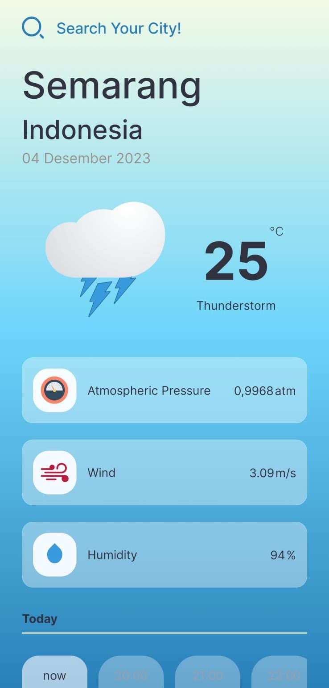
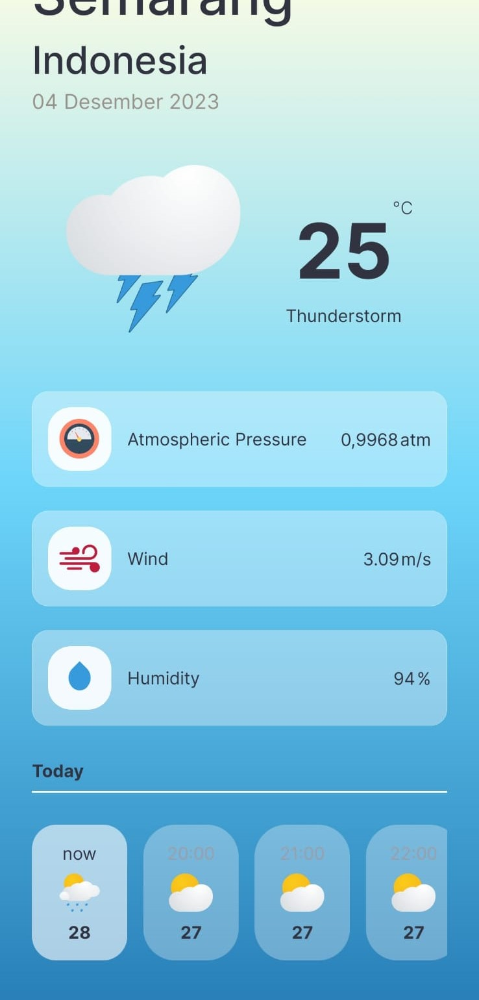
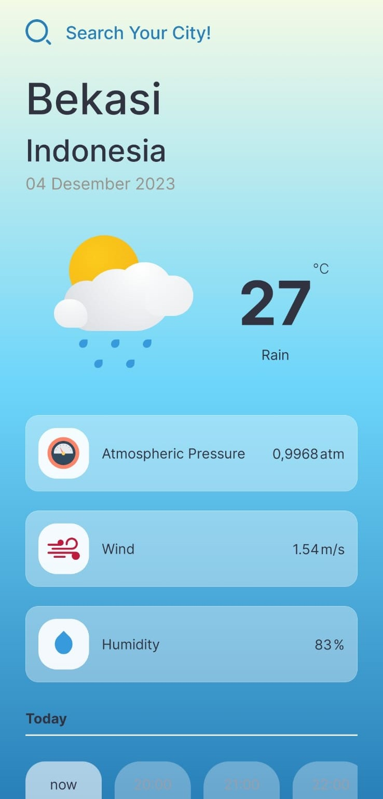

# MiraiWeather
**Tugas Besar Mata Kuliah Pengembangan Aplikasi Perangkat Bergerak**
- Aplikasi android untuk melihat kondisi cuaca berdasarkan API OpenWeatherMap
- Versi android yang dibutuhkan minimal 8.0 (Oreo)

**Anggota**
1. Naufal Yafi Susanto &nbsp;&nbsp;&nbsp;&nbsp;&nbsp;&nbsp;&nbsp;&nbsp;&nbsp;&nbsp;&nbsp;&nbsp;&nbsp;&nbsp;&nbsp;&nbsp;&nbsp;(21060120120011)
2. Reyhan Irfan Yahya &nbsp;&nbsp;&nbsp;&nbsp;&nbsp;&nbsp;&nbsp;&nbsp;&nbsp;&nbsp;&nbsp;&nbsp;&nbsp;&nbsp;&nbsp;&nbsp;&nbsp;&nbsp;(21060120140052) 
3. Satyagraha Pakarti Gemilang &nbsp;&nbsp;(21060120140075)

**Tangkapan Layar**

     

